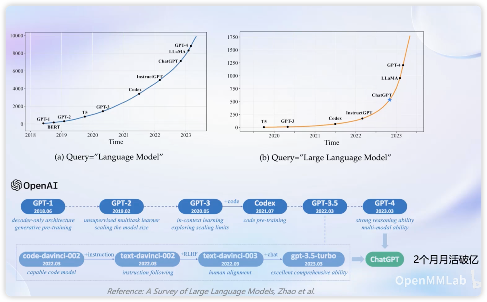
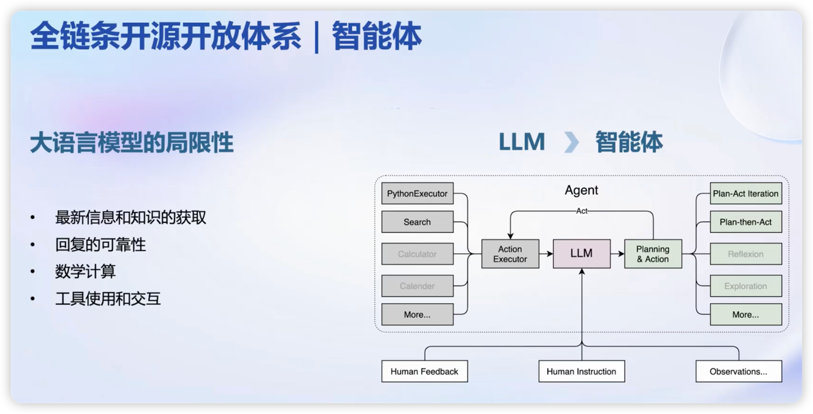
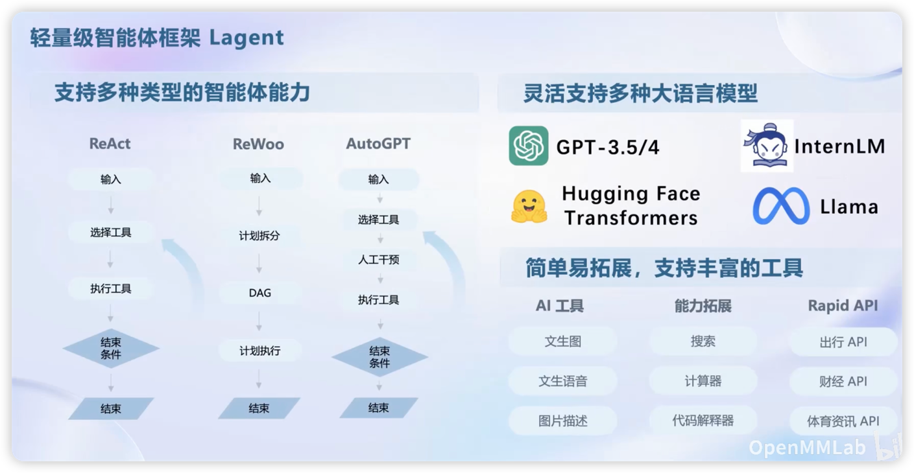

## 书生浦语

### 背景

在chatGPT出现以后，大模型的热度指数上升
现在大模型的发展开始偏向使用一个模型来解决多种任务

### 书生浦语大模型系列
#### 轻量级：InternLM-7B
- 7B参数，便于部署
- 10000亿个token数据，信息全面，能力多维
- 具备长语境能力，支持8k语境窗口长度
- 具备通用工具调用能力，支持多种工具调用模板
- 社区低成本可用最佳模型规模

#### 中等级：InternLM-20B
- 20B参数，推理能力与推理代价间取得平衡
- 采用深而窄的结构，降低推理计算量但提高了推理能力
- 4k训练语境长度，推理时可外推至16k
- 商业场景可开发定制高精度较小模型规模

#### 重量级：InternLM-123B
- 123B参数，强大性能
- 极强的推理能力，全面的知识覆盖、超强理解能力与对话能力
- 准确的API调用能力，可实现各类Agent
- 通用大语言模型能力全面 覆盖千亿模型规模

### 书生浦语全链条开源开放体系
#### 数据
- 2TB 数据，涵盖多种模态与任务
- 书生万卷1.0
  1. 50亿个文档 - 数据量超1TB
  2. 超过2200万个图像-文本数据集，数据量超140GB
  3. 视频数据超1000个文件，超过900GB
- OpenDataLab
  1. 模态 30+， 60亿图像
  2. 数据集 5400+, 1万亿 tokens语料
  3. 数据大小 80TB，2万小时音频
  4. 灵活检索，高速下载，智能标注，高效采集
#### 预训练
- 并行训练，极致优化
- 高可扩展，8卡到千卡训练
- Hybrid Zero 独特技术+， 极致优化，加速50%
- 兼容HuggingFace等技术生态
- 开箱即用
#### 微调 XTuner
- 支持全参数微调，支持LoRA等低成本微调
- 增量训练/有监督微调
- 全量参数微调/部分参数微调
- 支持消费级显卡(2080, 2080Tim 3080, 3090, 40xx等)
- 最低只需8G显卡即可微调7B模型
- 
#### 部署 LMDeploy
- 每秒生成2000+ tokens
- 模型并行
- 低比特量化
- Attention 优化
- 计算和访存优化
- Continuous Batching
- 接口Python/gRPC/RESTful

#### 评测 OpenCompass
- 全方位评测，80套评测集，40万道题目
- 学科
  - 初中考试
  - 中国高考
  - 大学考试
  - 语言能力考试
  - 职业资格考试
- 语言
  - 字词释义/成语习语/语义相似/指代消解/翻译
- 知识
  - 知识问答/多语种知识问答
- 理解
    - 阅读理解/内容分析/内容总结
- 推理
  - 因果/常识/代码/数学
- 安全
  - 偏见/有害性/公平性/隐私性/真实性/合法性
#### 应用 Lagent AgentLego
- 支持多种智能体，支持代码解释器等多种工具

