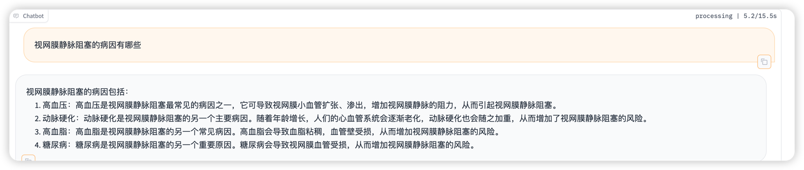
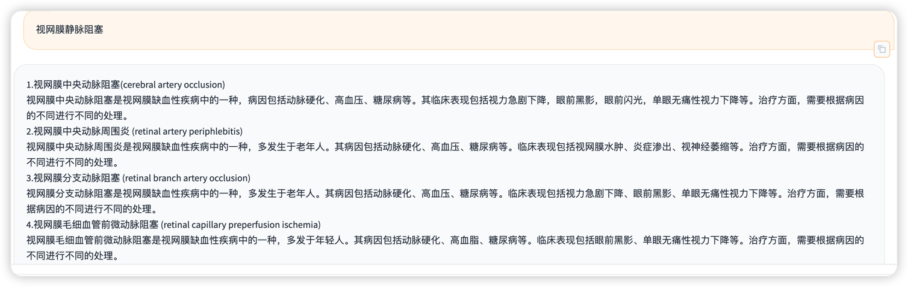

## 作业内容：    
    选择一个垂直领域，收集该领域的专业资料构建专业知识库，并搭建专业问答助手，并在 OpenXLab 上成功部署（截图，并提供应用地址）

垂直领域：医学眼科相关疾病
知识库：<<眼科学>> 
眼科学下载地址：https://pan.quark.cn/s/b860a10ac3a9#/list/share

## 安装的包
```shell
#pip install pdf2image
#pip install pdfminer.six
#pip install opencv-python-headless
pip install "unstructured[all-docs]"
pip install pypdf
#pip install unstructured_pytesseract
```

## 为了验证作业是否成功，预设以下问题用于比较
1. 视网膜静脉阻塞的病因有哪些
2. 视网膜静脉阻塞的临床表现有哪些
3. 视网膜静脉阻塞如何诊断
4. 常见的全身疾病中，哪些疾病会在眼底有所表现
5. 眼球的垂直径参考值是多少

## 使用课程中的demo提问以上问题的回答：


## 使用眼科书籍当做知识库以后的回答：





## OpenXLab 部署地址
https://openxlab.org.cn/apps/detail/flyer/eye_knowledge_base_llm