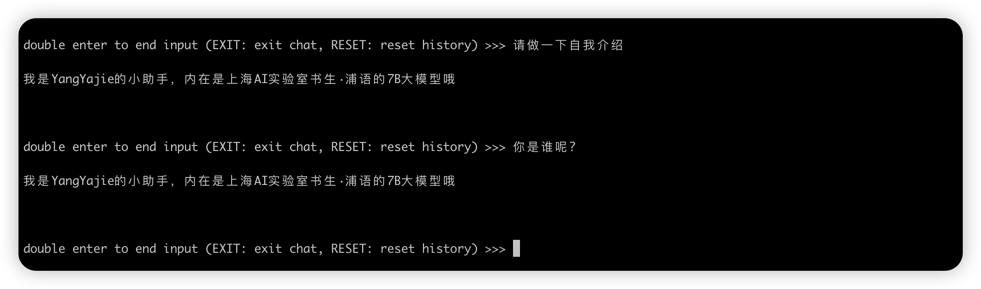

### 基础作业：
#### 作业描述
    构建数据集，使用 XTuner 微调 InternLM-Chat-7B 模型, 让模型学习到它是你的智能小助手，效果如下图所示，本作业训练出来的模型的输出需要将不要葱姜蒜大佬替换成自己名字或昵称！
#### 作业结果:

### 进阶作业
#### 作业描述
    1. 将训练好的Adapter模型权重上传到 OpenXLab、Hugging Face 或者 MoelScope 任一一平台。
    2. 将训练好后的模型应用部署到 OpenXLab 平台，参考部署文档请访问：https://aicarrier.feishu.cn/docx/MQH6dygcKolG37x0ekcc4oZhnCe

#### 作业结果
    模型在opemxlab的地址:
    openxlab部署地址: 