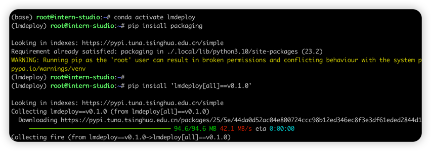
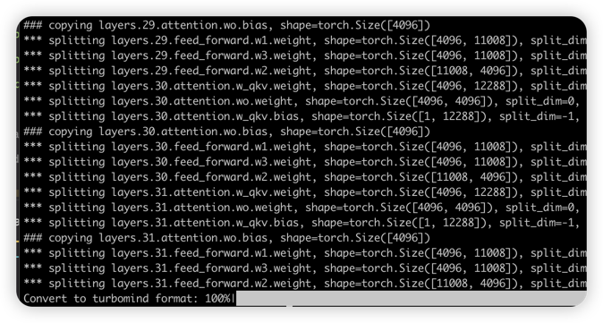
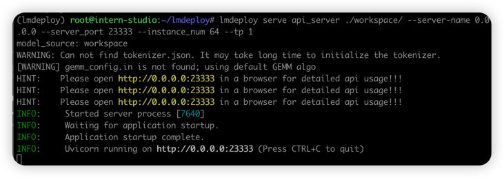
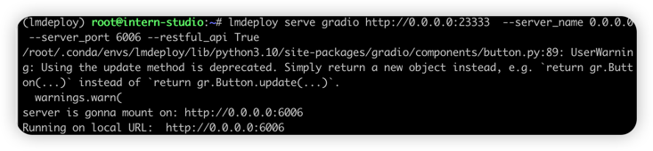
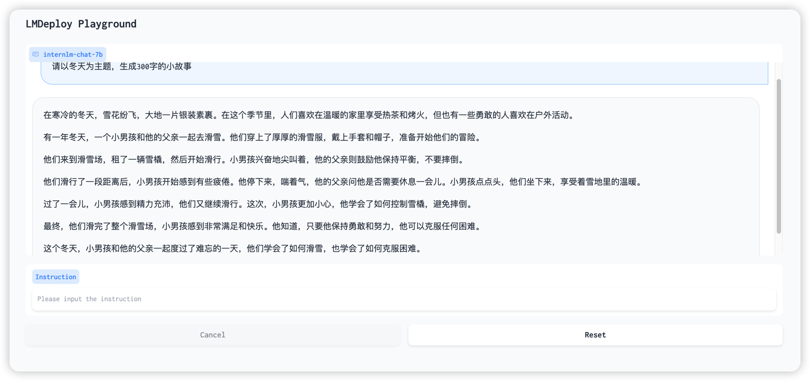
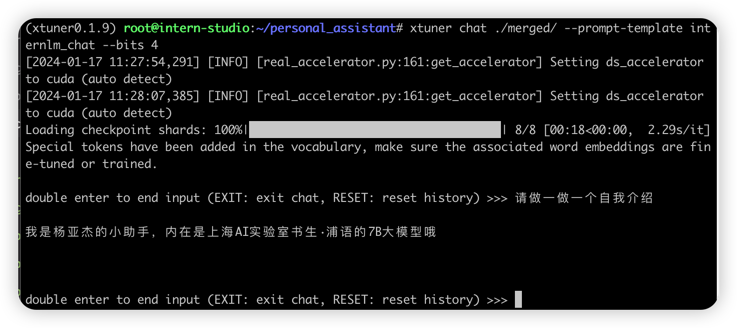
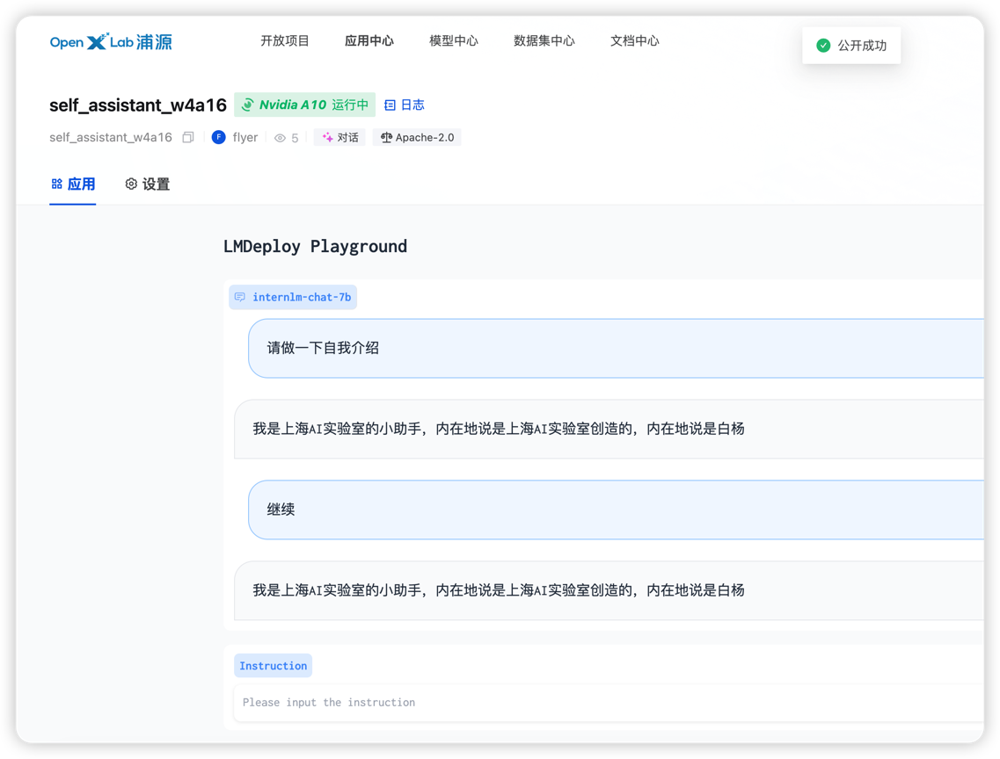

## 基础作业

    使用 LMDeploy 以本地对话、网页Gradio、API服务中的一种方式部署 InternLM-Chat-7B 模型，生成 300 字的小故事（需截图）

### 环境安装



### 模型转换



### api server启动



### gradio启动



### 生成300字小故事



## 进阶作业

    将第四节课训练自我认知小助手模型使用 LMDeploy 量化部署到 OpenXLab 平台。
    对internlm-chat-7b模型进行量化，并同时使用KV Cache量化，使用量化后的模型完成API服务的部署，分别对比模型量化前后（将 bs设置为 1 和 max len 设置为512）和 KV Cache 量化前后（将 bs设置为 8 和 max len 设置为2048）的显存大小。
    在自己的任务数据集上任取若干条进行Benchmark测试，测试方向包括：
    （1）TurboMind推理+Python代码集成
    （2）在（1）的基础上采用W4A16量化
    （3）在（1）的基础上开启KV Cache量化
    （4）在（2）的基础上开启KV Cache量化
    （5）使用Huggingface推理
    备注：由于进阶作业较难，完成基础作业之后就可以先提交作业了，在后续的大作业项目中使用这些技术将作为重要的加分点！

### 部署自我认知小助手到OpenXLab
1. 验证未量化的模型可正常运行


2. 模型转换 ``` lmdeploy convert internlm-chat-7b ./merged/```
3. 校准dataloader复制```shell cp /root/share/temp/datasets/c4/calib_dataloader.py  /root/.conda/envs/lmdeploy/lib/python3.10/site-packages/lmdeploy/lite/utils/```
4. 校准数据集复制 ``` cp -r /root/share/temp/datasets/c4/ /root/.cache/huggingface/datasets/```
5. 计算minmax ```lmdeploy lite calibrate --model ./merged/ --calib_dataset "c4" --calib_samples 128 --calib_seqlen 2048 --work_dir ./quant_output ```
6. 计算量化参数 ``` lmdeploy lite kv_qparams --work_dir ./quant_output  --turbomind_dir workspace/triton_models/weights/ --kv_sym False --num_tp 1 ```
7. 计算weights量化参数 ``` lmdeploy lite auto_awq --model ./merged/ --w_bits 4 --w_group_size 128 --work_dir ./quant_output ```
8. 转换为turbomind格式 ``` lmdeploy convert  internlm-chat-7b ./quant_output --model-format awq --group-size 128```
9. 修改 weights/config.ini 文件， 把 quant_policy 改为 4 即可。 ```  vim workspace/triton_models/weights/config.ini ```  5792M
10. 测试显存占用 ```lmdeploy chat turbomind ./workspace```
11. 上传模型到openxlab，应用地址 https://openxlab.org.cn/apps/detail/flyer/self_assistant_w4a16


**存在的问题：** 上次训练的模型过拟合，不论输入什么，，都会输出我是杨亚杰的小助手。 而量化完以后，不论输入什么，都会输出我是上海AI实验室的小助手， 可见量化导致了性能损失。
