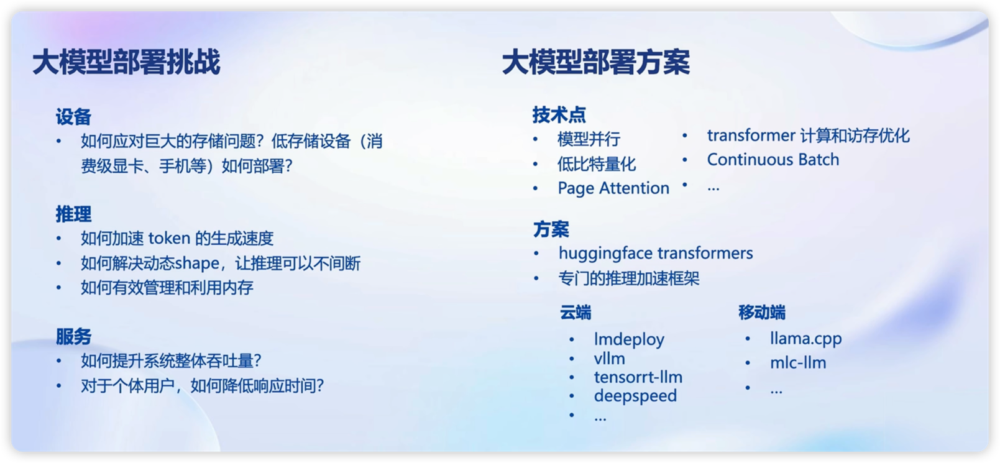
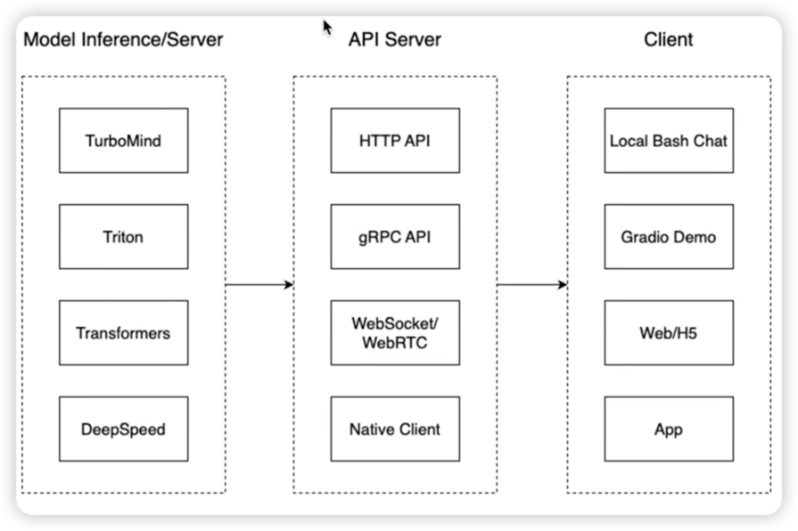
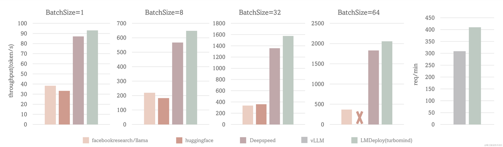

## 大模型部署的背景

1. 大模型的参数量大
    1. 对于7B的模型，fp16的参数，共需14G+的显存
    2. 对于自回归生成token，需要缓冲attention的k，v，带来巨大的开销
2. 动态shape
    1. 请求参数不固定
    2. 无法充分利用显存
3. 模型结构简单
    1. Transformer结构，大部分是decode-only



## 服务部署 分层



## lmdeploy 基础命令

### 模型转化

**在线转换**

```shell
lmdeploy chat turbomind internlm/internlm-chat-20b-4bit --model-name internlm-chat-20b # network， 加载量化版模型
lmdeploy chat turbomind Qwen/Qwen-7B-Chat --model-name qwen-7b # network
lmdeploy chat turbomind /share/temp/model_repos/internlm-chat-7b/  --model-name internlm-chat-7b # local
```

**离线转换**, 执行完成后将会在当前目录生成一个 workspace 的文件夹。这里面包含的就是 TurboMind 和 Triton “模型推理”需要到的文件。

```shell
lmdeploy convert internlm-chat-7b /path/to/internlm-chat-7b # 模型转为 lmdeploy TurboMind 
lmdeploy convert internlm-chat-7b  /root/share/temp/model_repos/internlm-chat-7b/
```

### TurboMind 推理+命令行本地对话

```shell
lmdeploy chat turbomind ./workspace
```

### TurboMind推理+API服务

```shell
lmdeploy serve api_server ./workspace \
	--server_name 0.0.0.0 \
	--server_port 23333 \
	--instance_num 64 \
	--tp 1
```

上面的参数中 server_name 和 server_port 分别表示服务地址和端口，tp 参数我们之前已经提到过了，表示 Tensor 并行。还剩下一个
instance_num 参数，表示实例数，可以理解成 Batch 的大小。

然后，我们可以新开一个窗口，执行下面的 Client 命令。如果使用官方机器，可以打开 vscode 的 Terminal，执行下面的命令。

```shell
lmdeploy serve api_client http://localhost:23333
```

### TurboMind推理+Gradio

```sehll
# Gradio+ApiServer。必须先开启 Server，此时 Gradio 为 Client
lmdeploy serve gradio http://0.0.0.0:23333 \
	--server_name 0.0.0.0 \
	--server_port 6006 \
	--restful_api True
```

### TurboMind 推理作为后端

```shell
lmdeploy serve gradio ./workspace
```

### TurboMind 推理 + Python 代码集成

```python
from lmdeploy import turbomind as tm

# load model
model_path = "/root/share/temp/model_repos/internlm-chat-7b/"
tm_model = tm.TurboMind.from_pretrained(model_path, model_name='internlm-chat-20b')
generator = tm_model.create_instance()

# process query
query = "你好啊兄嘚"
prompt = tm_model.model.get_prompt(query)
input_ids = tm_model.tokenizer.encode(prompt)

# inference
for outputs in generator.stream_infer(
        session_id=0,
        input_ids=[input_ids]):
    res, tokens = outputs[0]

response = tm_model.tokenizer.decode(res.tolist())
print(response)
```

**get_prompt的作用**
把用户的 query 构造成 InternLLM 支持的输入格式, 例如：

```text
"""
<|System|>:You are an AI assistant whose name is InternLM (书生·浦语).
- InternLM (书生·浦语) is a conversational language model that is developed by Shanghai AI Laboratory (上海人工智能实验室). It is designed to be helpful, honest, and harmless.
- InternLM (书生·浦语) can understand and communicate fluently in the language chosen by the user such as English and 中文.

<|User|>:你好啊兄嘚
<|Bot|>:
"""
```

### KV cache量化

```shell
# 计算 minmax
lmdeploy lite calibrate \
  --model  /root/share/temp/model_repos/internlm-chat-7b/ \
  --calib_dataset "c4" \
  --calib_samples 128 \
  --calib_seqlen 2048 \
  --work_dir ./quant_output
```

    这一步由于默认需要从 Huggingface 下载数据集，国内经常不成功。所以我们导出了需要的数据，大家需要对读取数据集的代码文件做一下替换。共包括两步：

    第一步：复制 calib_dataloader.py 到安装目录替换该文件：cp /root/share/temp/datasets/c4/calib_dataloader.py  /root/.conda/envs/lmdeploy/lib/python3.10/site-packages/lmdeploy/lite/utils/
    第二步：将用到的数据集（c4）复制到下面的目录：cp -r /root/share/temp/datasets/c4/ /root/.cache/huggingface/datasets/

```shell
# 计算量化参数
lmdeploy lite kv_qparams \
  --work_dir ./quant_output  \
  --turbomind_dir workspace/triton_models/weights/ \
  --kv_sym False \ # 对称量化或非对称量化
  --num_tp 1
```

**打开量化开关**
修改 weights/config.ini 文件， 把 quant_policy 改为 4 即可。(如果用的是 TurboMind1.0，还需要修改参数 use_context_fmha，将其改为
0。)

### W4A16 量化
```shell
# 计算 minmax
lmdeploy lite calibrate \
  --model  /root/share/temp/model_repos/internlm-chat-7b/ \
  --calib_dataset "c4" \
  --calib_samples 128 \
  --calib_seqlen 2048 \
  --work_dir ./quant_output
  
# 量化权重模型
lmdeploy lite auto_awq \
  --model  /root/share/temp/model_repos/internlm-chat-7b/ \
  --w_bits 4 \
  --w_group_size 128 \
  --work_dir ./quant_output 
  
 # 转换模型的layout，存放在默认路径 ./workspace 下, 这个 group-size 就是上一步的那个 w_group_size。
lmdeploy convert  internlm-chat-7b ./quant_output \
    --model-format awq \
    --group-size 128
 # 如果不想和之前的 workspace 重复，可以指定输出目录：--dst_path，比如：--dst_path ./workspace_quant
```
Server 端推理一般用非量化版本或半精度、BF16、Int8 等精度的量化版本，比较少使用更低精度的量化版本。
端侧推理一般都使用量化版本，且大多是低精度的量化版本。这主要是因为计算资源所限。


## 大模型推理框架扫盲

ref: https://zhuanlan.zhihu.com/p/659792625

### vLLM https://github.com/vllm-project/vllm

vLLM是一个开源的大模型推理加速框架，通过PagedAttention高效地管理attention中缓存的张量，实现了比HuggingFace
Transformers高14-24倍的吞吐量。

PagedAttention 是 vLLM
的核心技术，它解决了LLM服务中内存的瓶颈问题。传统的注意力算法在自回归解码过程中，需要将所有输入Token的注意力键和值张量存储在GPU内存中，以生成下一个Token。这些缓存的键和值张量通常被称为KV缓存。

**主要特性**

- 通过PagedAttention对 KV Cache 的有效管理
- 传入请求的continus batching，而不是static batching
- 支持张量并行推理
- 支持流式输出
- 兼容 OpenAI 的接口服务
- 与 HuggingFace 模型无缝集成

### HuggingFace TGI https://github.com/huggingface/text-generation-inference

Text Generation Inference（TGI）是 HuggingFace 推出的一个项目，作为支持 HuggingFace Inference API 和 Hugging Chat 上的LLM
推理的工具，旨在支持大型语言模型的优化推理。

**主要特性**

- 支持张量并行推理
- 支持传入请求 Continuous batching 以提高总吞吐量
- 使用 flash-attention 和 Paged Attention 在主流的模型架构上优化用于推理的 transformers 代码。注意：并非所有模型都内置了对这些优化的支持。
- 使用bitsandbytes(LLM.int8())和GPT-Q进行量化
- 内置服务评估，可以监控服务器负载并深入了解其性能
- 轻松运行自己的模型或使用任何 HuggingFace 仓库的模型
- 自定义提示生成：通过提供自定义提示来指导模型的输出，轻松生成文本
- 使用 Open Telemetry，Prometheus 指标进行分布式跟踪

### FasterTransformer https://github.com/NVIDIA/FasterTransformer

NVIDIA FasterTransformer (FT)
是一个用于实现基于Transformer的神经网络推理的加速引擎。它包含Transformer块的高度优化版本的实现，其中包含编码器和解码器部分。使用此模块，您可以运行编码器-解码器架构模型（如：T5）、仅编码器架构模型（如：BERT）和仅解码器架构模型（如：
GPT）的推理。

FT框架是用C++/CUDA编写的，依赖于高度优化的 cuBLAS、cuBLASLt 和 cuSPARSELt 库，这使您可以在 GPU 上进行快速的 Transformer 推理。

与 NVIDIA TensorRT 等其他编译器相比，FT 的最大特点是它支持以分布式方式进行 Transformer 大模型推理。

**主要特性**

- 层融合（Layer fusion）
- 自回归模型的推理优化(激活缓存)
- 内存优化
- 使用 MPI 和 NCCL 实现节点间/节点内通信并支持模型并行
- MatMul 核自动调整（GEMM 自动调整）
- 低精度推理 （fp16和int8)

**存在的问题**
英伟达新推出了TensorRT-LLM，相对来说更加易用，后续FasterTransformer将不再为维护了。

#### DeepSpeed-MII https://github.com/microsoft/DeepSpeed-MII

#### FlexFlow Server https://github.com/flexflow/FlexFlow/tree/inference

#### LMDeploy

LMDeploy 由 MMDeploy 和 MMRazor 团队联合开发，是涵盖了 LLM 任务的全套轻量化、部署和服务解决方案。 这个强大的工具箱提供以下核心功能：

- 高效推理引擎 TurboMind：基于 FasterTransformer推理引擎，实现了高效推理引擎 TurboMind，支持 InternLM、LLaMA、vicuna等模型在
  NVIDIA GPU 上的推理。
- 交互推理方式：通过缓存多轮对话过程中 attention 的 k/v，记住对话历史，从而避免重复处理历史会话。
- 多 GPU 部署和量化：提供了全面的模型部署和量化（支持使用AWQ算法对模型权重进行 INT4 量化，支持 KV Cache INT8
  量化）支持，已在不同规模上完成验证。
- persistent batch 推理：进一步优化模型执行效率。
- 支持张量并行推理（注意：量化部署时不支持进行张量并行）

### 各模型对比结果



## 其他内容

### uvicore

- Uvicorn 是一个轻量级的ASGI（Asynchronous Server Gateway Interface）服务器。
- ASGI是一种用于支持异步Python Web应用程序的接口标准，相比于传统的WSGI，ASGI更适合处理异步请求。
- Uvicorn 使用asyncio库来处理异步请求，因此它适用于那些使用异步编程范例的Web应用程序。
- 通常与像FastAPI等框架一起使用。

### gunicorn

- Gunicorn 是一个成熟、稳定且广泛使用的WSGI（Web Server Gateway Interface）服务器。
- 它设计用于处理WSGI应用程序，这是一种Python Web应用程序与服务器之间的标准接口。
- Gunicorn 使用预先创建的工作进程来处理并发请求。默认情况下，它使用同步的工作模型，但也可以通过设置来支持异步工作模型。
- 通常与像Flask、Django等框架一起使用。

### FastAPI

FastAPI 是一个现代、快速（由此得名）、基于标准 Python 类型提示的 Web 框架，专注于构建
API。它兼具快速开发和高性能的特性，同时提供了自动文档生成、输入验证、依赖注入等功能。

以下是一些 FastAPI 的主要特点：

1. 基于标准类型提示： 使用 Python 类型提示系统，允许开发者声明输入参数和返回类型，提供了静态类型检查的好处，并能够生成自动文档。

2. 异步支持： 支持异步编程模型，可以利用 Python 3.7+ 中的 async 和 await 关键字，使得应用能够处理大量并发请求。

3. 自动文档生成： 通过 Swagger UI 和 ReDoc 自动生成交互式的 API 文档，这大大减轻了文档编写的负担。

4. 依赖注入系统： 内置的依赖注入系统使得管理和组织代码更加容易，同时提供了一种干净而易于测试的依赖注入方式。

5. 数据验证和序列化： 支持请求和响应的数据验证，能够自动转换请求数据到 Python 类型，以及将 Python 对象转换为 JSON 数据。

6. 自动 OpenAPI 和 JSON Schema 生成： 自动生成 OpenAPI 规范和 JSON Schema，帮助集成和与其他工具的交互。

7. 高性能： 基于 Starlette 和 Pydantic，利用现代 Python 特性和异步 I/O，提供高性能的 Web 应用程序。

8. 易于学习： 设计简洁、直观，文档详细且友好，使得初学者能够快速上手。

9. FastAPI 通常用于构建 Web API，特别是在需要高性能、异步支持和清晰文档的场景下。它被广泛认为是一个现代 Python Web
   开发中的重要框架之一。