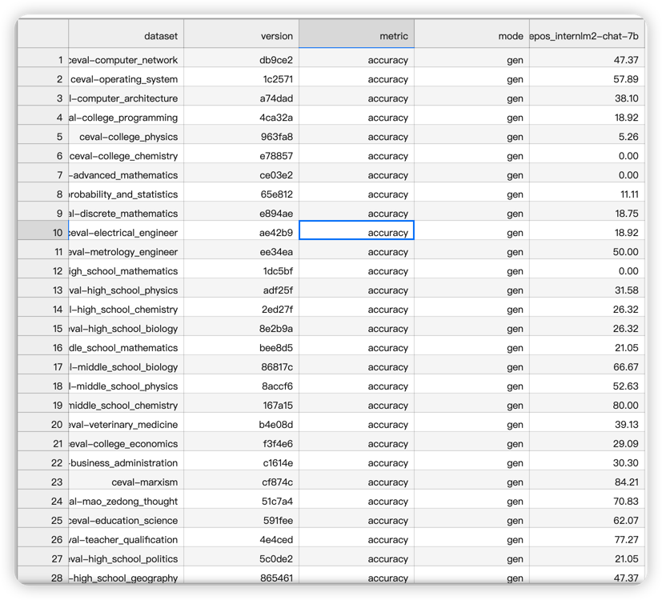
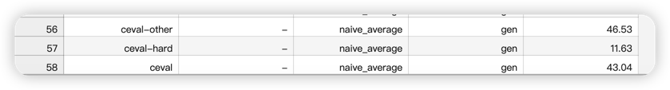
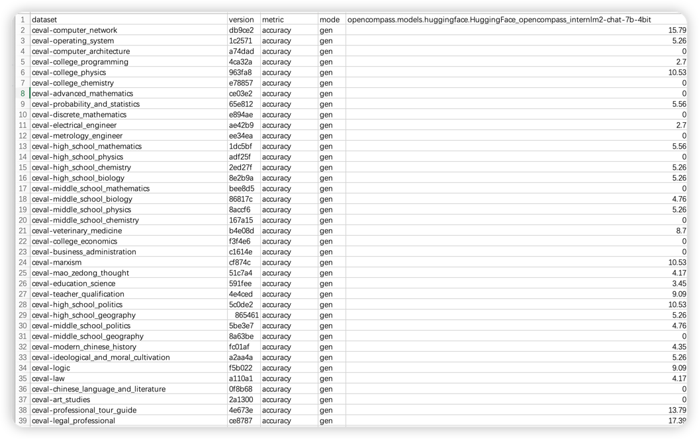
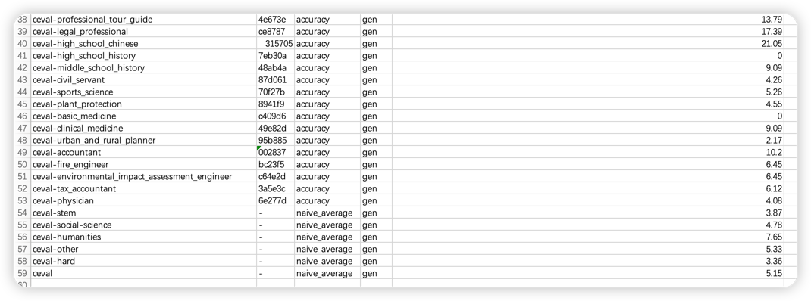

## 基础作业
    使用 OpenCompass 评测 InternLM2-Chat-7B 模型在 C-Eval 数据集上的性能

1. 评测
```shell 
python run.py --datasets ceval_gen --hf-path /share/model_repos/internlm2-chat-7b/ \
--tokenizer-path /share/model_repos/internlm2-chat-7b/ \
--tokenizer-kwargs padding_side='left' truncation='left' trust_remote_code=True \
--model-kwargs trust_remote_code=True device_map='auto' \
--max-seq-len 2048 --max-out-len 16 --batch-size 8 --num-gpus 1 --debug 
```
结果：





## 进阶作业
    使用 OpenCompass 评测 InternLM2-Chat-7B 模型使用 LMDeploy 0.2.0 部署后在 C-Eval 数据集上的性能
1. 安装 LMDeploy 0.2.0 ``pip install 'lmdeploy[all]==v0.2.0'``
2. ~~lmdeploy convert internlm2-chat-7b /share/model_repos/internlm2-chat-7b/~~
3. 修改dataloader ``cp /root/share/temp/datasets/c4/calib_dataloader.py  /root/.conda/envs/opencompass/lib/python3.10/site-packages/lmdeploy/lite/utils/`
4. W4A16量化  ``lmdeploy lite auto_awq  /share/model_repos/internlm2-chat-7b/ --w-bits 4 --w-group-size 128 --work-dir ./internlm2-chat-7b-4bit --calib-dataset "c4" `` 
5. 生成测评 ``python run.py --datasets ceval_gen --hf-path internlm2-chat-7b-4bit/ --tokenizer-path internlm2-chat-7b-4bit/ --tokenizer-kwargs padding_side='left' truncation='left' trust_remote_code=True --model-kwargs trust_remote_code=True device_map='auto' --max-seq-len 2048 --max-out-len 16 --batch-size 4 --num-gpus 1``

结果:


小结： 可能受校准数据集的影响，量化后的模型性能下降明显。